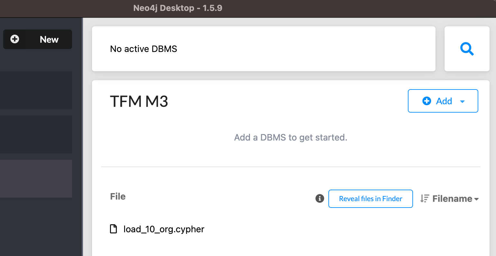
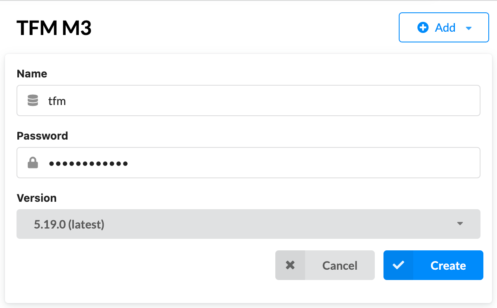
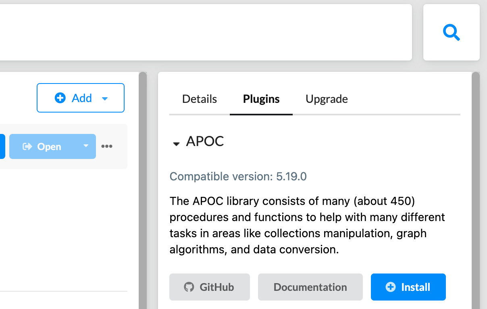
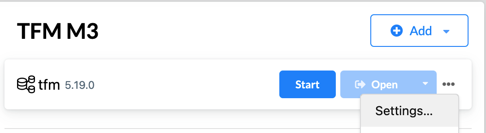
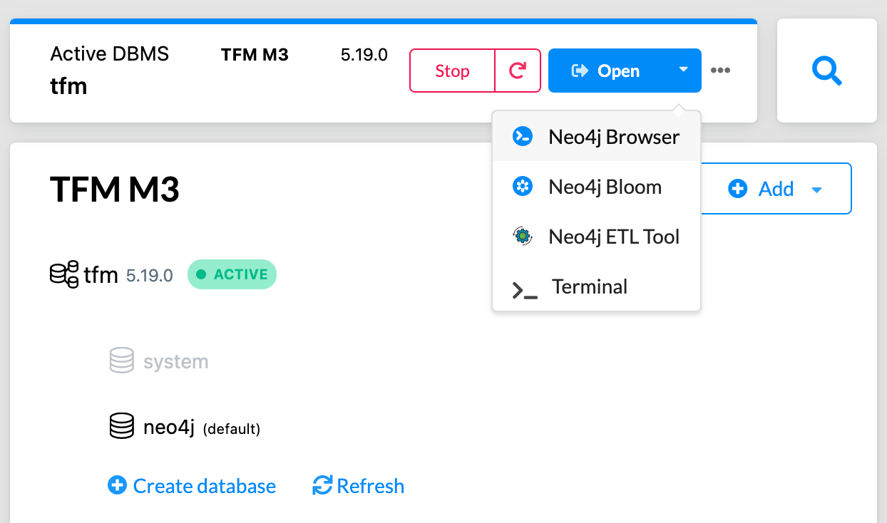
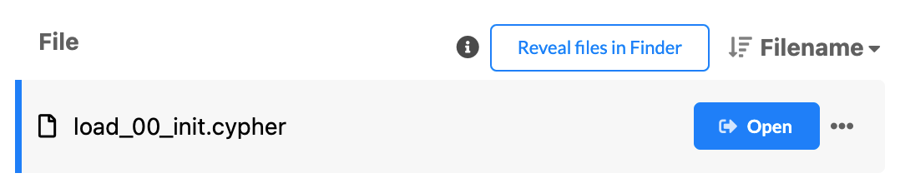
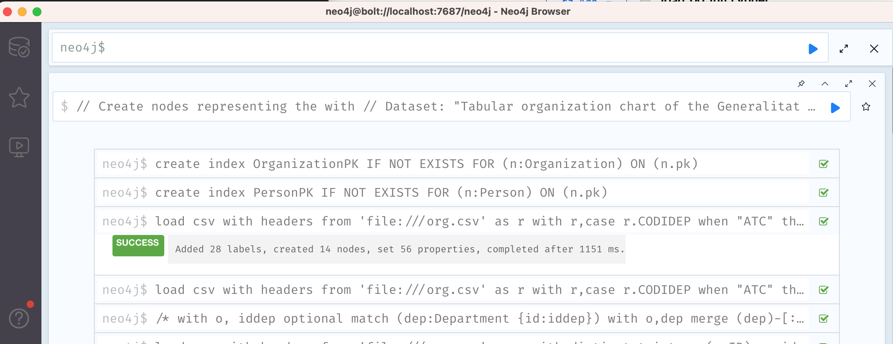
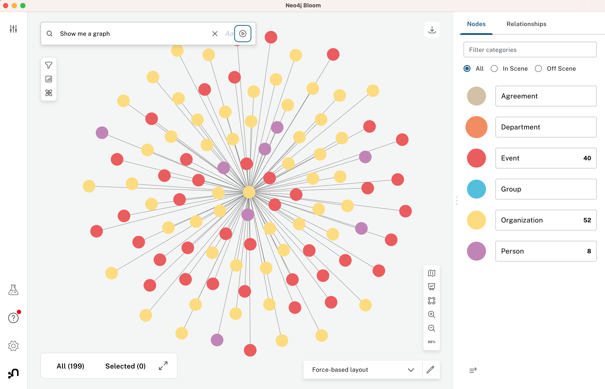

# Application of LLM-Augmented Knowledge Graphs for Wirearchy Management

### Universitat Oberta de Catalunya
### Data Science Master's Degree - Data Analysis and Big Data. Final project (Delivery M3 May 2024)

- Author: Xavier Ventura de los Ojos
- Project Supervisor: Francesc Julbe López
- Coordinating Professor: Albert Solé Ribalta
- Date of submission: 06/2024

### Abstract
Today’s organization structures are porous, where formal hierarchies are intertwined with dynamic networks of interactions. This situation was coined as “Wirearchy”. These structures are often volatile making very difficult to have a reliable picture of the actual organization. This unclarity can make some decision process difficult when not risky. Even worse pieces of the full picture sit with a few individuals eventually jeopardizing this corporate knowledge.
While the Wirearchy is not persisted in a shared system, gathering this information is time consuming and error prone.

To alleviate this problem, we propose leveraging two main technologies: Knowledge Graphs (KG) and Large Language Models (LLM).
Graphs are ideal to model and persist these domains due to the interconnected nature of the organizational structures. But then we still need to deal with two challenges. How to keep this graph up-to-date and reliable? How can it be easily exploited by non-IT population? To solve them, recent research indicates that state of the art LLMs can be of use via LLM-augmented KG and natural language question and answer techniques.
We propose to validate these statements by performing a proof of concept using graph engines and state of the art LLMs and determining its feasibility and performance against a test dataset.

### Master Thesis: Deliverable M3.

This deliverable consists of the following components:

* This document
* Public datasets
* Jupiter Notebooks for the POCs 1 and 2.
* Results of the POCs executions.

This document provides the instructions to deploy all the required project artifacts:

* Datasets for graph.
* Graph Database.
* POC 1: How to query a KG using Natural Language.
* POC 2: How to enrich a KG extracting content from unstructured documents.

## Datasets for graph

The graph is built using the following public files available in the Generalitat de Catalunya Open Data portal:

https://administraciodigital.gencat.cat/ca/dades/dades-obertes/les-dades-obertes/que-son-les-dades-obertes/

https://analisi.transparenciacatalunya.cat

* [Tabular organization chart of the Generalitat de Catalunya](https://analisi.transparenciacatalunya.cat/Sector-P-blic/Organigrama-tabular-de-la-Generalitat-de-Catalunya/czns-gsc6/about_data) (org.csv)
* [Register of interest groups in Catalonia](https://analisi.transparenciacatalunya.cat/en/Legislaci-just-cia/Registre-de-grups-d-inter-s-de-Catalunya/gwpn-de62/about_data) (grups.csv)
* [Public agenda with interest groups of senior officials and management personnel](https://analisi.transparenciacatalunya.cat/Sector-P-blic/Agenda-p-blica-amb-grups-d-inter-s-dels-alts-c-rre/hd8k-y28e/about_data) (agenda.csv)
* [Registration of Collaboration and Cooperation Agreements](https://analisi.transparenciacatalunya.cat/Sector-P-blic/Registre-de-Convenis-de-Col-laboraci-i-Cooperaci-/exh2-diuf/about_data) (convenis.csv)

## Graph Database

The project requires the Neo4j Graph Database.
Neo4j Desktop is a very convenient option to work with Neo4j:
https://neo4j.com/docs/desktop-manual/current/

### Graph Creation

Follow these steps to create the graph and load the CSV files downloaded from the Open Data portal.

- Open the Neo4j Desktop application.
- Create a New project from directory. Choose the "neo4j" folder that contains the csv files and the cypher scripts.
- Select the newly created project. You can rename it by clicking on the project's name.

- Add a new Local DBMS using version 5.18.1 or above. 
> **Note:** Carefully write down the provided database name and password.

- Once the database is created, we need to install the APOC plugin. Click on the database, then on the right panel click on "Plugins". Open the APOC section and click "Install".

- Change the value of the "server.directories.import" setting. Replace the value "import" with the absolute path where the CSV files are located.
- Add a new setting "db.transaction.timeout=60s" to prevent any wrongly created query to continue executing after 1 minute.
You might need longer execution time for the data load below. In this case set the "db.transaction.timeout=10m" 

- Start the database. Once started you'll have access to Neo4j Browser and Bloom applications.

[LOAD CSV](https://neo4j.com/docs/cypher-manual/current/clauses/load-csv/#_configuration_settings_for_file_urls)

### Loading files

The following CYPHER files are provided for the graph creation from the CSV files. They must be executed in the following sequence.

| Filename | CSV | Description |
| ----- | ---- | --- |
| load_00_init.cypher | | Initialize the database by deleting ALL nodes. |
| load_10_org.cypher | org.csv | Creates the "Department", "Organization" and "Person" nodes. Creates the CHILD_OF and RESPONSIBLE_OF relationships |
| load_20_grups.cypher | grups.csv | Creates the "Group" nodes. |
| load_30_agenda_org.cypher | agenda.csv | Creates additional "Organization" nodes and update properties. 
| load_31_agenda_event.cypher | agenda.csv | Creates "Events", additional "Group" and "Person". Creates the PARTICIPATE relationship. |
| load_32_agenda_role.cypher | agenda.csv | Creates the REPONSIBLE_OF relationship |
| load_40_convenis.cypher | convenis.csv | Creates the "Agreement" nodes and the "LINKED_TO" relationship. |

To execute each Cypher script click on filename and then the "Open" button.

This will open the script in the Neo4j Browser interfase.  
Click the Run button (blue triangle) and wait for the script execution.  
You can see the outcome of each command by clicking on each line in the output window.

Once all the scripts are successfully executed, a graph with the following schema will be available:

Graph nodes:

- Department: Refers to the structure of the Government of Catalonia.  
- Organization: Refers to the structure of the Government of Catalonia.  
- Group: Refers to groups of interests who lobbie with the Government. It could be companies, schools, ngo or any other association.
- Person: Refers to public servants or individuals representing groups of interests.
- Event: Refers to events where Government and Groups of interest meet for different reasons.
- Agreement: Refers to formal binding agreements between Government and groups of interests.

Graph relationships:

- CHILD_OF: Indicates the organization's hierarchy. 
- RESPONSIBLE_OF: Indicates who is in charge of a given position (role) on a given period of time.
- PARTICIPATE: Indicates who participated in a given event. In the case of the person the "role" property tells the role that the person had at that time.
- LINKED_TO: Connects the different agreements which are related to a master agreement.

The graph can be explored using Neo4j Bloom:

Use Neo4j Browser to execute Cypher queries on the graph. 

- Change the database timeout setting to 60 seconds "db.transaction.timeout=60s".

**IMPORTANT:** It is possible for the LLM to produce Data Manipulation Language (DML) statements such as **INSERT, MERGE or DELETE** if it is instructed to do so. It is not in the scope of the POC to setup a less privileged connection to Neo4j that would prevent any unwanted change on the graph.

  

## POC 1: How to query a KG using Natural Language.

In this POC we showcase how prompt engineering techniques using state of the art Large Language Models (LLM) can provide a Knowledge Graph with Natural Language query capabilities.

It is not in the scope of the POC to build an application with chat or Q&A capabilities but to use the necessary building blocks and to measure the performance of these tools on a set of predefined questions.

Instead of an interactive UI, the code in this Notebook allows performing tests on questions datasets (questions.json) using the indicated configuration (configurations.json). Questions, answers and related metadata is store in JSON files (poc1_answers folder) for proper analysis.

For a detailed analysis of the interactions with the LLMs, it is recommended to configure [LangSmith](https://smith.langchain.com).

These are the LLMs in scope of the POC:

|Vendor| Model | Description |
|---|---|--|
|[OpenAI](https://openai.com)|[GPT-3.5 Turbo](https://platform.openai.com/docs/models/gpt-3-5-turbo)|The latest GPT-3.5 Turbo model with higher accuracy at responding in requested formats and a fix for a bug which caused a text encoding issue for non-English language function calls. Returns a maximum of 4,096 output tokens.|
|[OpenAI](https://openai.com)|[GPT-4o](https://platform.openai.com/docs/models/gpt-4o)|Our most advanced, multimodal flagship model that’s cheaper and faster than GPT-4 Turbo. Currently points to gpt-4o-2024-05-13.|
|[Anthropic](https://www.anthropic.com)|[Claude 3 Haiku](https://docs.anthropic.com/en/docs/models-overview)|Our most powerful model, delivering state-of-the-art performance on highly complex tasks and demonstrating fluency and human-like understanding|
|[Anthropic](https://www.anthropic.com)|[Claude 3 Opus](https://docs.anthropic.com/en/docs/models-overview)|Our fastest and most compact model, designed for near-instant responsiveness and seamless AI experiences that mimic human interactions|

**IMPORTANT:** It is possible for the LLM to produce Data Manipulation Language (DML) statements such as **INSERT, MERGE or DELETE** if it is instructed to do so. It is not in the scope of the POC to setup a less privileged connection to Neo4j that would prevent any unwanted change on the graph.

 

**The POC 1 is available in the "poc1 query graph.ipynb" Jupiter Notebook.**

 
 

## POC 2: How to enrich a KG extracting content from unstructured documents.

Once the initial graph is modeled and the nodes and relationships created from structured files, we propose enriching it by extracting additional information from unstructured documents.
This task is known as Named Entity Recognition or NER.

In this POC 2 we showcase how Large Language Models (LLM) can be used to perform this NER task. 
The process consists on sending the extraction instructions (prompt) including the document content (text only) and the schema of interest.
Following the template instruction, the model should result the content in the form of a python dict.
The structured output from the LLM is enriched and then saved in a JSON file. 
This file is used for model performance analysis and for the actual enrichment of the graph.

It is NOT in the scope of the POC 2:
- Process images or sounds as input for the model.
- Implement a Langchain (generic) Agent that would categorize the document and proxy it to the corresponding extractor chain / schema. Instead we will focus on a specific use case.

### Use case: Agreements.

To illustrate the end to end process from entity identification to graph enrichment, we focus on a specific scenario which is relevant to the graph dataset.

The documents used for this POC 2 are the agreements published in PDF format in the open [Registre de Convenis of the Generalitat de Catalunya](https://registredeconvenis.gencat.cat) 

The information about the agreements is already part of the graph in the form of nodes labeled "Agreement".
But these nodes are isolated from the other entities.

The goal of this POC 2 is to connect the isolated "Agreement" nodes to the rest of the Graph.
More especificaly the connection will happen by:

* Creating necessary new "Person" nodes.
* Creating the SIGNED relationship between the "Person" nodes and the agreement.
* Adding the role, organization and document properties to the SIGNED relationship.
* Creating new Groups if the organization does not exist already.
* Creating the REPRESENT relationship between the Person and the Organization or Group.
* Creating the SIGNED relationship between the Organization or Group and the Agreement.

 

**The POC 2 is available in the "poc2 enrich graph (agreements).ipynb" Jupiter Notebook.**

 

## Python environment

There are several options to execute a Jupiter Notebook. 
One option is [Anaconda](https://www.anaconda.com/download)

Executing the Notebook cells is an optional activity. 
The results of the executions are already provided in JSON files.

Follow the instructions here for Langchain installation in the created conda enviroment:

https://python.langchain.com/docs/get_started/installation/

To execute the code it is necessary to have API Keys for:

- OpenAI
- Anthropic
- LangSmith

Use the following conda statements to configure the required environment variables:

    % conda env config vars set NEO4J_PWD=\<your Neo4j pwd\>  
    % conda env config vars set OPENAI_API_KEY=\<your OpenAI API KEY to access GPT models\>  
    % conda env config vars set ANTHROPIC_API_KEY=\<your Anthropic API KEY to access Claude 3 models\>  
    % conda env config vars set LANGCHAIN_API_KEY=\<your LangSmith API Key to monitor the API usage\>  

 

## License

See the [LICENSE](./LICENSE.TXT) file for license rights and limitations (CC BY-NC-ND 4.0).

**End of the TFM_Xavier_Ventura_2024_M3 document**

